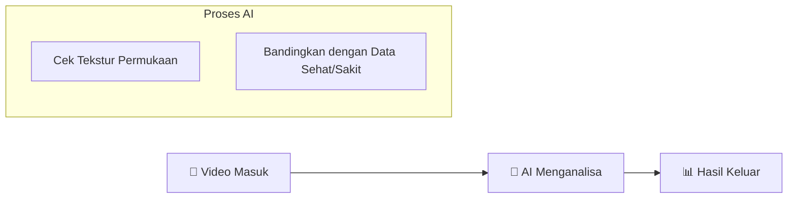

# Outline Presentasi: Analisis Citra Kolonoskopi (AI)

Berikut adalah outline presentasi 10 slide yang disusun dengan bahasa yang sangat sederhana untuk audiens awam. Fokus pada alur "Input -> Proses -> Output" dan gambaran visual.

---

## Slide 1: Judul Proyek
**Teks Utama:**
> **Sistem Analisis Cerdas untuk Kolonoskopi**
> *(Mendeteksi Kesehatan Usus Menggunakan Video)*

**Gambar/Visual:**
- Logo atau ikon usus/kesehatan yang simpel.
- Nama Tim Pengembang.

**Poin Bicara:**
- "Hari ini kami ingin menunjukkan alat bantu pintar untuk pemeriksaan usus (kolonoskopi)."

---

## Slide 2: Mengapa Kita Butuh Ini? (Latar Belakang)
**Masalah:**
- Dokter kadang kelelahan melihat video usus yang panjang.
- Perubahan kecil pada dinding usus (tekstur kasar/halus) kadang sulit dilihat mata telanjang.

**Solusi Kami:**
- Membuat AI (Kecerdasan Buatan) yang "menonton" video bersama dokter.
- Memberi peringatan jika melihat area yang tidak normal.

**Gambar/Visual:**
- Ikon Dokter + Ikon Mata + Ikon Komputer/AI.

---

## Slide 3: Cara Kerjanya (Flowchart Sederhana)
**Diagram Alur:**

**Penjelasan:**
1. **Input:** Video rekaman kolonoskopi.
2. **Proses:** Komputer memeriksa setiap gambar, melihat pola kasar/halus permukaannya.
3. **Output:** Memberi warna atau sinyal jika ada peradangan.

---

## Slide 4: Belajar dari Data Apa? (Dataset)
**Konsep:**
- AI kami diajari membedakan 4 kondisi usus (Skala Mayo).

**Tampilan:**
- Tampilkan 4 gambar berdampingan (ambil screenshot dari folder `data_sample` atau referensi medis):
    - **Mayo 0 (Sehat):** Permukaan halus, pembuluh darah jelas.
    - **Mayo 1 (Ringan):** Sedikit kasar, pembuluh darah mulai kabur.
    - **Mayo 2 (Sedang):** Merah, kasar, tidak ada pola pembuluh darah.
    - **Mayo 3 (Parah):** Berdarah, sangat kasar/rusak.

**Caption:**
"Kami melatih komputer untuk mengenali 4 level keparahan ini."

---

## Slide 5: Seperti Apa Inputnya?
**Visual:**
- **Screenshot:** Tampilan video mentah (tanpa coretan AI).
- Bisa ambil screenshot dari aplikasi saat baru upload video, sebelum tombol "Run Analysis" ditekan.

**Penjelasan:**
- "Ini adalah video asli yang dilihat dokter. Terkadang gejalanya samar."

---

## Slide 6: Apa yang AI Lihat? (Proses Analisis)
**Konsep:**
- AI tidak melihat "gambar" seperti kita, tapi melihat "pola matematika" (Tekstur).

**Visual:**
- **Screenshot Fitur:** Tampilkan bagian "Feature Signature" (Radar Chart - Grafik Jaring Laba-laba) dari aplikasi.
- Tunjukkan garis "Normal (Hijau)" vs "Parah (Merah)".

**Penjelasan:**
- "Komputer mengukur seberapa kasar atau halus permukaannya. Grafik ini menunjukkan perbedaannya."

---

## Slide 7: Hasil Visual (Peta Panas / Heatmap)
**Visual:**
- **Screenshot Utama:** Video yang sudah di-overlay warna (misal: area merah/biru).
- Ambil ini dari aplikasi saat fitur "Heatmap Overlay" aktif.

**Penjelasan:**
- "Kami memberi 'warna' pada video."
- **Merah/Kuning:** Area yang dicurigai sakit/radang.
- **Biru/Transparan:** Area sehat.
- "Dokter bisa langsung fokus ke area yang berwarna."

---

## Slide 8: Hasil Angka & Peringatan (Alert System)
**Visual:**
- **Screenshot:** Bagian "Alert" atau notifikasi di aplikasi (Contoh: "⚠️ Inflammation Detected!").
- Tampilkan juga grafik garis (Trend Plot) yang naik turun seiring waktu.

**Penjelasan:**
- "Jika peradangan terdeteksi, sistem langsung memberi peringatan (Alert)."
- "Grafik menunjukkan perubahan kondisi usus sepanjang video berjalan."

---

## Slide 9: Apa yang Sudah Selesai Dikerjakan?
**Daftar Capaian:**
1. ✅ **Analisis Real-time:** Bisa proses video langsung, tidak perlu menunggu lama.
2. ✅ **Deteksi Tekstur:** Bisa membedakan permukaan halus vs kasar.
3. ✅ **Visualisasi Mudah:** Ada "peta warna" dan grafik sederhana untuk dokter.
4. ✅ **Kalibrasi Otomatis:** Sistem bisa menyesuaikan diri dengan kualitas video yang berbeda.

**Visual:**
- Kolase (gabungan) kecil dari screenshot slide 6, 7, dan 8.

---

## Slide 10: Gambaran Akhir & Masa Depan
**Visi Kami:**
- Alat ini akan terpasang langsung di layar monitor ruang operasi.
- Membantu dokter muda/pemula agar tidak salah diagnosa.
- Meningkatkan akurasi pemeriksaan secara otomatis.

**Tampilan:**
- Gambar ilustrasi ruang operasi modern atau dokter yang sedang melihat layar dengan tenang.
- Kalimat penutup: *"Teknologi untuk Kesehatan yang Lebih Baik"*

---

### Catatan untuk Pembuat PPT:
- **Warna:** Gunakan warna cerah tapi profesional (Biru Medis, Hijau Sehat, Merah Alert).
- **Font:** Besar dan jelas (Arial/Helvetica), hindari teks terlalu banyak (cukup poin-poin).
- **Gambar:** Usahakan Screenshot asli dari aplikasi agar terlihat nyata dan meyakinkan.
